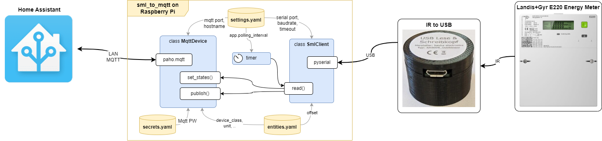

# Converting SML to MQTT
This `sml_to_mqtt.py` runs on a __Rasberry Pi__. It reads SML energy data from a __Landis+Gyr E220 energy meter__ and publishes that data to __MQTT__ to __Home Assistant__.



## How to run
Start `sml_to_mqtt.py` from the project directory
```
username@raspberrypi:~/Desktop/sml_to_mqtt $ python sml_to_mqtt.py
```

__OR__ 

Let __crontab__ run the program upon reboot. To do so, open crontab in edit mode:
```
username@raspberrypi:~/Desktop $ crontab -e
```
and add the following line
```
@reboot python /home/pi/Desktop/sml_to_mqtt/sml_to_mqtt.py &
```

## How to configure
Configuration is done via `setting.yaml` and `entities.yaml` (parameters documented within the files) as well as an `secrets.yaml`, which is not part of this repository. It must hold MQTT username and password in the form:
```yaml
mqtt_auth:
  user: YOUR_MQTT_USERNAME
  password: YOUR_MQTT_PASSWORD
```

# Notes to the development

- The SML decoder is inspired by https://github.com/huirad/pysml´.

- When applying that SML decoder to my particular Landis+Gyr E220 energy meter I found only two "offsets" to be useful:
  `offset` | Interpretation           | MQTT entity
  -------- | ------------------------ | ---------------
  171      | Meter value 1.8.0 in kWh | energy_imported
  202      | Meter value 2.8.0 in kWh | energy_exported

- The `MqttDevice` class is reused from the [Raspi_Walli_MQTT project](https://github.com/munich-ml/raspi_walli_mqtt).